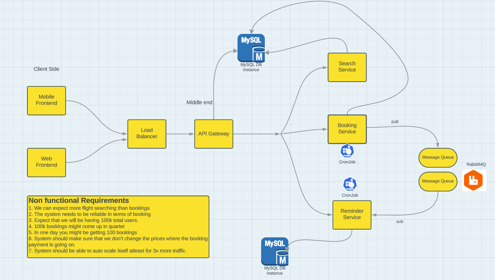

# Airline Ticket Booking Backend System

## Objective
- We need to build a backend feature for an airline company. our end-user is going to be someone who wants to book flights and query about flights, so we need a robust system to actually help them give the best experience possible.

- This Doc is going to solely focus on Backend Part. We want to prepare the whole backend keeping in the fact in mind that code-base should be easily maintainable as much as possible.

## Requirements
- A user should be able to search for flights from one place to another.
    - User should be able to mention the `src` and `dest` details.
    - User should be able to select the class of the flights. (Non-mandatory, have some default value)
    - User should be able to select the number of seats. (Non-mandatory, have some default value)
    - List down the flights based on the above data.
    - The best available flights should be shown based on price and least journey time.
    - Need to support pagination so that we can list chunk of flights at one point of time.
    - Filter of flights should be supported based on Price, Departure Time, Arrival time, Journey time, etc. _{V2 -> some more filters}_
- A user should be able to book a flight considering that user is registered on the platform.
    
- Tracking of the flight prices should be possible; user should be notified for any price drops or any delays. _{V2 -> some more notification service}_
- For booking, the user has to make a payment. `(dummy)`
- User should be able to list their previous and upcoming flights.
- User should be able to download their boarding pass if they have done `Web Check-in`.
- `Web Check-in` should be supported.
    - _{V2 -> Seat Selection feature}_
- Notification via email for `Web check-in`.
- Reqview system for users iff they have booked the flight.
    - Star based review system
    - Listing of flights should involve review display.
- User should be able to authenticate to our system using email and password.
- Cancellation of a flight should be supported and cancellation returns (dummy).
- While making a booking, a persone can reserve more than one seat with one login id.

## Non-Functional Requirements
Non functional Requirements
1.  We can expect more flight searching than bookings
2.  The system needs to be reliable in terms of booking
3.  Expect that we will be having 100k total users.
4.  100k bookings might come up in quarter
5.  In one day you might be getting 100 bookings
6.  System should make sure that we don?t change the prices where the
    booking payment is going on.
7.  System should be able to auto scale itself atleast for 3x more traffic.

---

The Flight Service Backend Project is based on a microservice architecture, comprising four distinct microservices that collectively provide a comprehensive flight management system.

The first microservice, Flight Service, acts as the core component and encompasses multiple models, including airplane, airport, city, flight, and seat models. This microservice handles all the essential functionalities related to flights, airports, and cities. It enables efficient scheduling and allocation of airplanes, manages flight routes and durations, and facilitates seat reservations for passengers.

The second microservice, Flight Booking Service, focuses on the booking process and includes the booking model. It incorporates cron jobs that run every 30 minutes to automatically check for pending or initiated bookings with expired payment times. In such cases, the bookings are automatically canceled. Additionally, this microservice utilizes RabbitMQ to send booking information to a queue for further processing by the fourth microservice.

The third microservice, Flight API Gateway Service, provides a centralized entry point for accessing the flight service's functionalities. It incorporates user and role models for managing user information and permissions. This microservice includes features such as rate limiting to control API usage, reverse proxy for efficient routing, authentication system using JWT (JSON Web Tokens) for user authentication, and an authorization system to ensure access control based on user roles.

The fourth microservice, Flight Notification Service, is responsible for sending notifications to users regarding their flight bookings. Once a booking is successfully processed and confirmed, the second microservice sends the relevant information to a queue. The Flight Notification Service then consumes the messages from the queue and uses Node Mailer to send emails to users, providing them with details about their successful bookings.

Collectively, these microservices work together to create a robust flight management system. The Flight Service microservice handles flight-related operations and models, the Flight Booking Service automates booking cancellations and manages booking queues, the Flight API Gateway Service provides a secure and efficient gateway for user interactions, and the Flight Notification Service ensures timely and accurate notifications to users via email.
## Tech Stack
- **Node Js**
- **Express Js**
- **mySQL**
- **Sequelize**
- **RabbitMQ**

## Authentication Service
URL: <https://github.com/GeekyVarun/Auth_Service.git>

## Booking Service
URL: <https://github.com/GeekyVarun/AirTicketBookingService>

## Email Service
URL: <https://github.com/GeekyVarun/ReminderService>

## Flights Service
URL: <https://github.com/GeekyVarun/FlightsAndSearchService.git>
